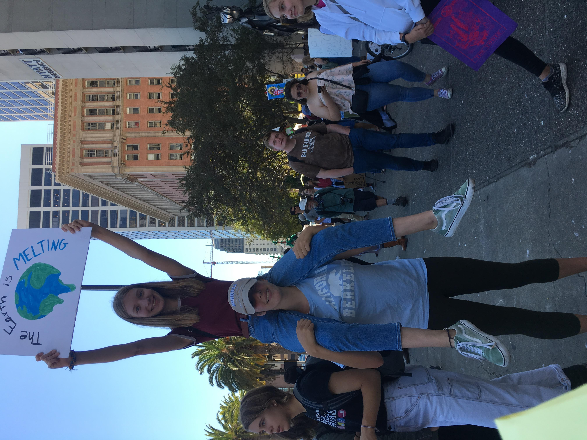
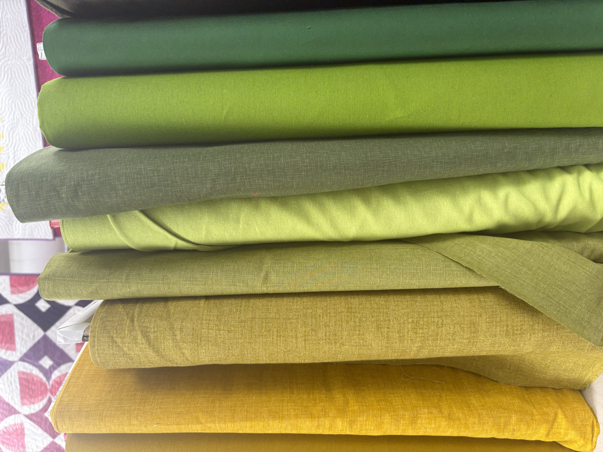

# Origin

I credit a lot of my interest in helping the Environment to growing up in Berkeley, California. Climate Change was a constant topic of conversation and protests were the norm. It was attending so many protests that ingraioned the value of grassroots, protests, and on the ground action in me. While not all protests are successful, when done right with genuine passion, they can achieve great goals.

Furthermore, I was always encouraged to be open to ideas different than my own, on all sides of the political spectrum. My great-grandfather was a Supreme Court Justice who valued different perspectives. My desire to see all perspectives has also inspired an interest in protected areas, which typically involve various stakeholders with differing viewpoints, from fisherman to environmentalists.

 

# Multicultural

While my interest in travel and the globe is mainly self-guided, my family is largely multicultural. My father is Dutch and my mother is half-Hispanic with roots tracing to the Basques of Spain. Additionally, my father grew up in Japan, thus I grew up with some Japanese influences and two older sisters who were half-Japanese. Therefore, I was always surrounded by and appreciative of other cultures.

# Outside Interests

I am a big appreciator of food and the arts. I will try any food at least once and consider it a great way to build community, peer into another culture, or connect with the natural world. I also love to create art, mainly clothing. I sew many of my own clothes including my prom dress, and have volunteered at zero-waste inspired sew-repair events. Aside from fashion, there is also a lot to be learned from art history, street-art, and architecture.

